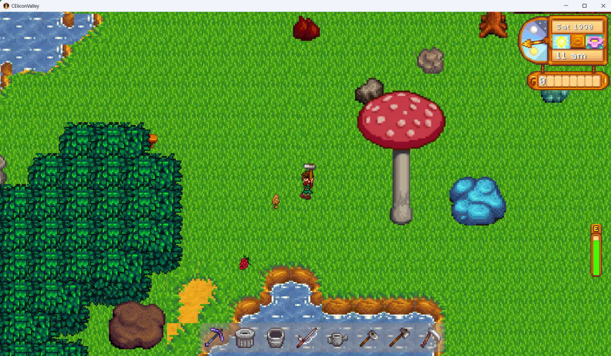

# CEliconValley

CEliconValley is a 2D multiplayer farming simulation game developed in Java. Inspired by Stardew Valley, this project was built from the ground up as a university final project for our Advanced Programming course. The development was divided into three main phases: starting with the core terminal-based logic, moving into a 2D graphical interface, and finally implementing real-time multiplayer networking.

### Architecture
The project runs on a standard Client-Server architecture to ensure that all players stay synchronized. We kept the game logic heavily server-side to maintain a single source of truth.

*   **Server:** Handles the core game loop, time progression, weather, NPC routines, and player states. It listens for incoming actions, updates the internal game state, and broadcasts the changes.
*   **Client:** Built using the **LibGDX** framework. The client is strictly responsible for rendering the map, handling animations, playing audio, and capturing user inputs to send to the server.

### Networking
For communication between the clients and the server, we used the **Java-WebSocket** library. The game relies on real-time data exchange rather than turn-based turns.

Data is packaged into custom message objects and serialized into JSON format using **Gson**. When a player moves, plants a seed, or sends a message, a JSON payload is sent to the server. The server's router parses the message, executes the logic, and broadcasts the updated state (like player coordinates or map changes) back to the relevant clients in the lobby. Threading is heavily utilized on the server to handle multiple lobbies and concurrent player actions without freezing the game loop.

### Database
We used **MongoDB** along with **Morphia** (an Object-Document Mapper for Java) to handle data persistence. Because game data—like nested inventories, farm grid states, and player skills—is highly hierarchical, a NoSQL document database made much more sense than a traditional relational database.

The database is responsible for storing:
*   User accounts, hashed passwords, and profile information.
*   Active and saved game states (so players can resume their farms later).
*   Friendship levels, completed quests, and economy statistics.

### Key Features
*   **Real-Time Multiplayer:** Join lobbies with up to 4 players. You can see your friends walking around, farming, and using tools in real-time.
*   **Farming Mechanics:** A full crop lifecycle system. Till the soil, plant seeds, water them daily, and harvest them according to the current season.
*   **Animal Husbandry & Fishing:** Build coops and barns to raise animals, or head to the water to catch seasonal fish through a custom fishing minigame.
*   **Player Trading & Economy:** Buy supplies from NPCs, sell your yield through the shipping bin, or open a live trade window to exchange items and coins directly with other players.
*   **Social & Chat:** An in-game chat system that supports public messages, direct tagging, and floating emote reactions above players' heads.
*   **Dynamic World:** A working time and calendar system featuring changing weather, seasons, and NPCs that follow specific daily routines.
*   **Live Scoreboard & Voting:** Check player rankings based on money or skills on the fly, and use the voting system to pause, terminate, or manage the lobby.

### Getting Started

**Prerequisites:**
*   Java 17 or higher
*   MongoDB installed and running locally on the default port (`localhost:27017`)
*   Maven

**Running the Server:**
1. Navigate to the server directory.
2. Run the `TerminalMain` class to initialize the database connection and start the WebSocket server.

**Running the Client:**
1. Navigate to the client directory.
2. Run the `Lwjgl3Launcher` class to launch the game window.
3. Register a new account, create or join a lobby, and start playing.
